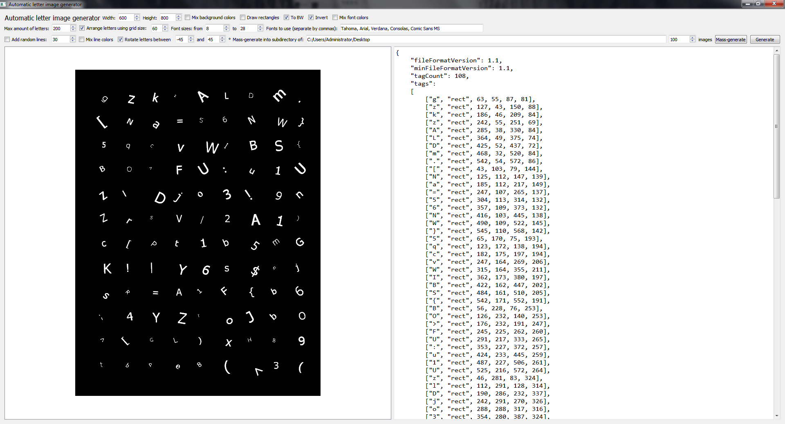
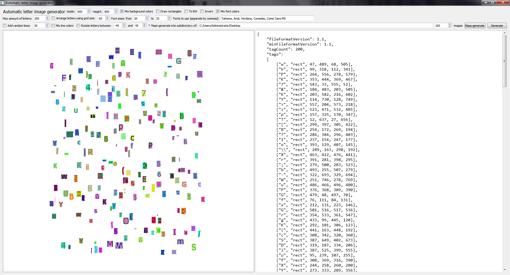

# AutogenLetterImgs
Generator of tagged images of letters, with customizable parameters such as rotation and background.  
Also generates associated .taglist.json files for the images (see ImageTagger). If specified, CAFFE-style train.txt files can be generated instead.  
Written in Qt/C++.

## Download

Download link: [Win32 binary](https://github.com/Extender/AutogenLetterImgs/raw/master/bin/autogenletterimgs-v1.1-bin-win32.zip)

## Screenshots

